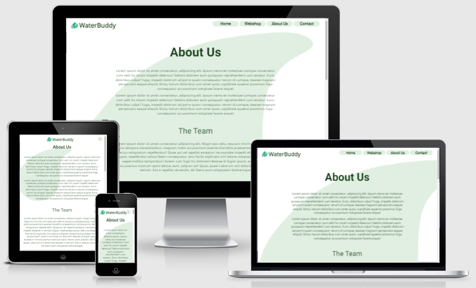

# WaterBuddy

 

WaterBuddy is our fictional business project for the course Front-end Design & Development of our Computer Science education on the Avans Academy of Applied Science. We were tasked to come up with a company who sells IT-products and/or services and create a website for it.

This GitHub repository is the outcome of that assignment.

💻 **Live Page:** www.waterbuddy.nl

## Table on Contents

- [About Us](#about-us)
- [Division of Tasks](#division-of-tasks)

## About Us

Our consists of: Huseyin, Lieke, Milan, Roy.

## Division of Tasks
